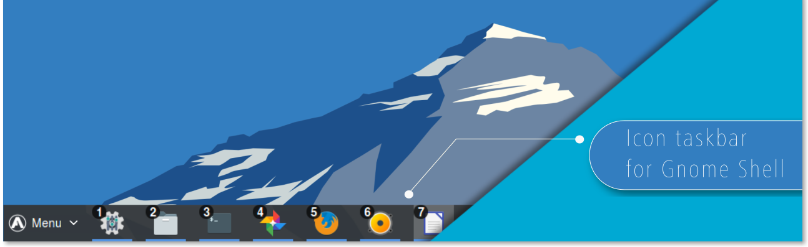
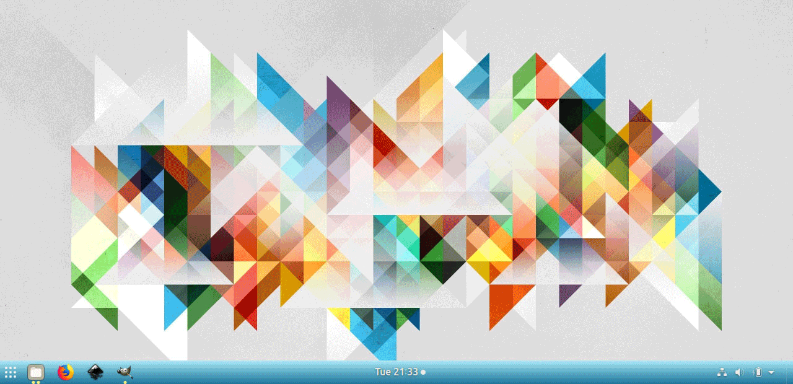
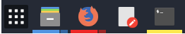
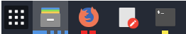
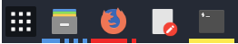
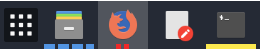
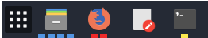
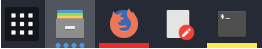
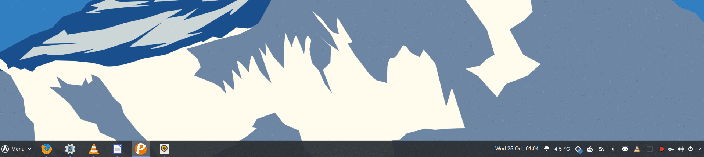
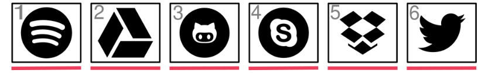

  

    
    

### Introdução

O One Panel é uma barra de tarefas de ícones do Gnome Shell. Essa extensão move o traço para o painel principal do gnome para que os lançadores de aplicativos e a bandeja do sistema sejam combinados em um único painel, semelhante ao encontrado no KDE Plasma e no Windows 7+. Um dock separado não é mais necessário para facilitar o acesso a aplicativos em execução e favoritos.

Além disso, praticamente todos os aspectos do painel são totalmente personalizáveis. Desde posicionamento e dimensionamento de elementos de painel a indicadores de execução, exibição de vários monitores, visualizações de janelas e até mesmo inteligência, o One Panel tem tudo que você precisa para fazer seu espaço de trabalho se sentir em casa.

### Características

|Aparência customizável|
|:-----:|
||
|Ocultar e mostrar elementos do painel e definir suas posições, tamanhos e cores|

##

<table>
    <thead>
        <tr>
            <th colspan=2>Indicadores de execução personalizáveis</th>
        </tr>
    </thead>
    <tbody>
        <tr>
            <td align="center">Metro</td>
            <td align="center">Ciliora/Dashes</td>
        </tr> 
        <tr>
            <td align="center"></td>
            <td align="center"></td>
        </tr>
        <tr>
            <td align="center">Ciliora</td>
            <td align="center">Squares/Segmented</td>
        </tr> 
        <tr>
            <td align="center"></td>
            <td align="center"></td>
        </tr>
        <tr>
            <td align="center">Dashes</td>
            <td align="center">Dots/Solid</td>
        </tr> 
        <tr>
            <td align="center"></td>
            <td align="center"></td>
        </tr>
        <tr>
            <td colspan=2 align="center">Defina a posição, o estilo, o peso e a cor dos indicadores de execução para identificar com facilidade e rapidez aplicativos focados e sem foco</td>
        </tr>
    </tbody>
</table>

##

|Live Previews on Hover|
|:-----:|
||
|Passe o mouse sobre o ícone do iniciador de um aplicativo aberto para obter uma visualização da janela ao vivo|

##
|Launch by Number|
|:-----:|
||
|Opcionalmente, lance seus aplicativos favoritos via teclado|

##

|Panel Intellihide|
|:-----:|
||
|Esconda e revele o painel de acordo com as suas preferências|

##
|Additional Features|Feature Implemented|
|:-----|:-----:|
|Add "Show Desktop" button to panel||
|Isolate running apps by workspaces and/or monitors||
|Custom click behaviors (launch new window, cycle open windows, minimize, etc)||
|Integrate native Gnome appMenu into right-click secondary menu||
|Multi-monitor support||
|Dynamic transparency||
|Ungroup application windows||
|Export and import settings||
##
### Compatibilidade

Esta extensão foi testada com o Gnome 3.18+.

Esta extensão manipula o Painel Principal do Gnome, também conhecido como Top Bar. Assim, a maioria das outras extensões que operam na barra superior deve ser compatível.

##
### Precisa-se de voluntários!

Esta extensão pode ser ainda melhor com a sua ajuda!

## 
### Credits

This extension is developed and maintained by [@jderose9](https://github.com/jderose9) and [@charlesg99](https://github.com/charlesg99).

Significant portions of code in this extension were derived from [Dash-to-Dock](https://micheleg.github.io/dash-to-dock/index.html).

Additional credits: This extension leverages the work for [ZorinOS Taskbar](https://github.com/ZorinOS/zorin-taskbar) (used in [ZorinOS](https://zorinos.com/)) to show window previews and allow the dash from [Dash-to-Dock](https://micheleg.github.io/dash-to-dock/index.html) to be embedded in the Gnome main panel.
Code to set anchor position taken from [Thoma5/gnome-shell-extension-bottompanel](https://github.com/Thoma5/gnome-shell-extension-bottompanel).
Pattern for moving panel contents based on [Frippery Move Clock](http://frippery.org/extensions/) by R M Yorston.
Ideas for recursing child actors and assigning inline styles are based on code from the extension [StatusAreaHorizontalSpacing](https://bitbucket.org/mathematicalcoffee/status-area-horizontal-spacing-gnome-shell-extension).

## 
### License & Terms 

 
